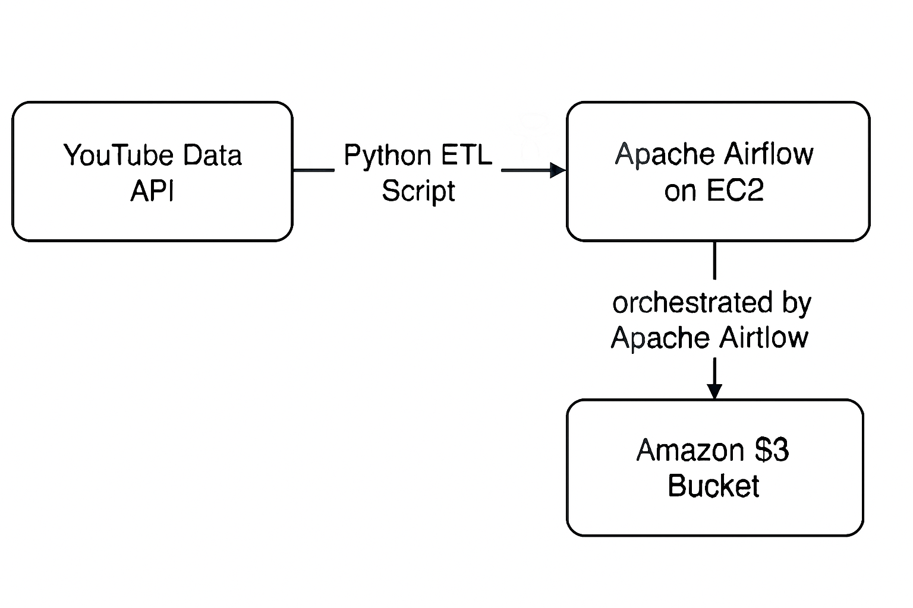

# YouTube Comments ETL Pipeline with Apache Airflow

This project builds a scalable ETL (Extract, Transform, Load) pipeline to collect comments from YouTube videos using the YouTube Data API. The pipeline is orchestrated using Apache Airflow and deployed on an AWS EC2 instance. The final output — a cleansed dataset of YouTube comments — is stored in an Amazon S3 bucket.

---

## 📌 Project Overview

This ETL pipeline:

- **Extracts** comments from YouTube videos via YouTube Data API  
- **Transforms** them into a structured tabular format using Pandas  
- **Loads** the data as a `.csv` file into an S3 bucket for storage and downstream analytics

---

## 🧭 Architecture

The high-level architecture of this pipeline is:

**YouTube Data API → Python ETL Script → Apache Airflow on EC2 → Amazon S3**

- The process is fully **orchestrated by Apache Airflow**, running on an EC2 instance.
- Data is extracted from YouTube using Python, transformed into a DataFrame using Pandas, and then uploaded as a CSV file to Amazon S3.

### Architecture Diagram



---

## 📁 Project Structure
```
.
youtube-comments-etl/
│
├── dags/
│   ├── youtube_comments_dag.py
│
├── youtube_comments_etl_api.py
├── assets/
│   └── youtube_etl_architecture.png   
│
├── youtube_commands.sh
├── requirements.txt                   
└── README.md                          
```

---

## ⚙️ Technologies Used

- **Apache Airflow**: Workflow orchestration  
- **YouTube Data API v3**: Data extraction  
- **Python (Pandas, s3fs, google-api-python-client)**: Data manipulation and S3 integration  
- **Amazon EC2**: Compute environment  
- **Amazon S3**: Data lake for storing extracted comments

---

## 🔁 Workflow (DAG)

### Airflow DAG (`youtube_comments_dag.py`)

- **Scheduled** to run daily (`timedelta(days=1)`)  
- Runs a PythonOperator that triggers the `run_youtube_etl()` function

### ETL Logic (`youtube_comments_etl_api.py`)

1. **Extract**:  
   - Takes YouTube video IDs  
   - Fetches comments using `googleapiclient.discovery.build`  
2. **Transform**:  
   - Parses and normalizes JSON response  
   - Structures data into a `pandas.DataFrame`  
3. **Load**:  
   - Saves the DataFrame as CSV  
   - Uploads to a specified S3 bucket using `s3fs`

---

## 🚀 Deployment Steps

### 1. ✅ Launch an EC2 Instance

- Use Ubuntu  
- Choose `t2.medium` or higher (for resource needs)  
- Open inbound port `8080` in the **Security Group** to allow Airflow Web UI access

### 2. ⚙️ Set Up EC2 Environment

SSH into your EC2 instance and run:

```bash
sudo apt-get update
sudo apt install python3-pip python3-venv

```

### 3. 🐍 Create a Virtual Environment

```bash
python3 -m venv airflow-env
source airflow-env/bin/activate
```

### 4. 📆 Install Airflow and Dependencies

```bash
export AIRFLOW_VERSION=2.9.0
export PYTHON_VERSION="$(python --version | cut -d " " -f 2 | cut -d "." -f 1,2)"
export CONSTRAINT_URL="https://raw.githubusercontent.com/apache/airflow/constraints-${AIRFLOW_VERSION}/constraints-${PYTHON_VERSION}.txt"

pip install "apache-airflow==${AIRFLOW_VERSION}" --constraint "${CONSTRAINT_URL}"
pip install pandas s3fs google-api-python-client
```

### 5. 🔐 Set Up IAM Role for S3 Access

- Attach the **AmazonS3FullAccess** or a custom policy with `s3:PutObject`, `s3:GetObject`, etc. to the EC2 instance's IAM Role.
- Ensure your bucket name is correctly referenced in your ETL script.

### 6. ?? Place Your DAG and ETL Scripts

Upload `youtube_comments_dag.py` and `youtube_comments_etl.py` to:

```bash
~/airflow/dags/youtube_comments_dag/
```

### 7. 🚦 Start Airflow

```bash
airflow standalone
```

- Login using the credentials printed in the terminal
- Access the UI at:\
  `http://<EC2_PUBLIC_DNS>:8080/`

---

## ✅ Sample Output

- `youtube_comments.csv` is stored in: `s3://your-s3-bucket-name/youtube_comments.csv`

---


